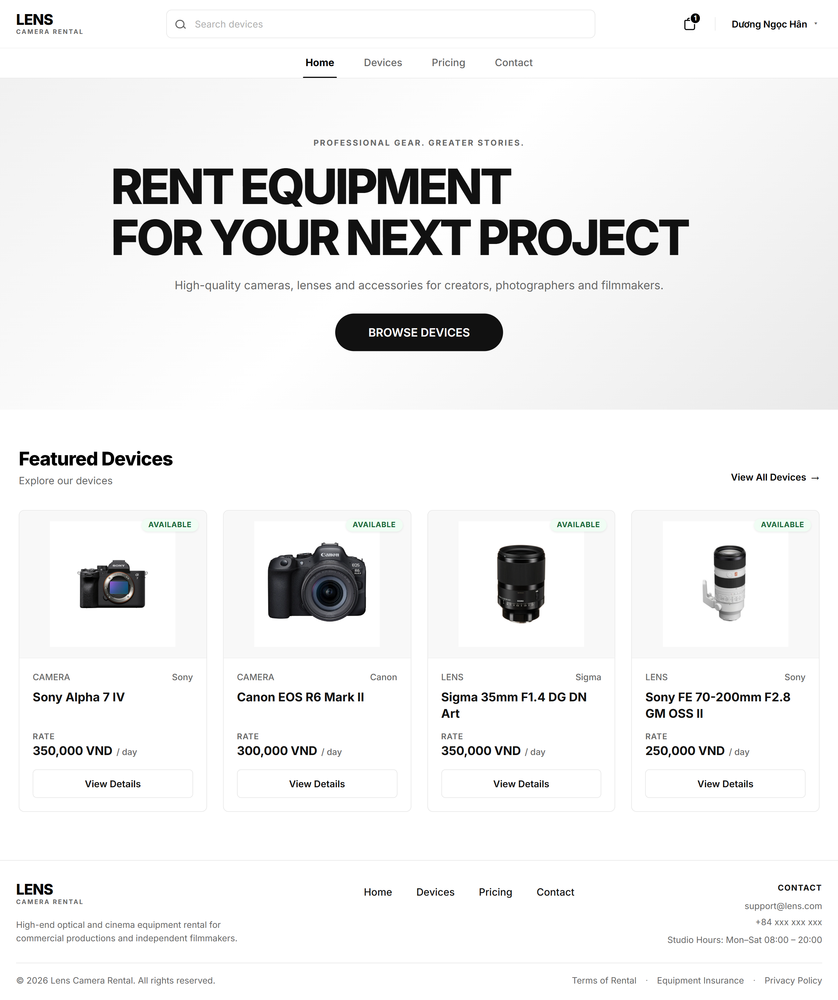

# Lens Camera Rental

<p align="center">
  
</p>

<p align="center">A camera rental management system built with Jakarta EE.</p>

<p align="center">
  
  
  
  
  
  
  
  
  
</p>

---

## Overview

Lens Camera Rental supports camera discovery, rental requests, and order management. Customers can select rental dates, check availability, build a cart, choose pickup or delivery, and track orders. Admin tools cover user, device model, physical device, and rental order management.

## Core Capabilities

| Customer | Admin |
|---|---|
| Browse the camera catalog and view details | Manage users, device models, and physical devices |
| Select a rental period and check availability | Review, approve, or reject rental orders |
| Manage cart items and proceed through checkout | View the dashboard and monitor rentals |
| Choose store pickup or delivery | Manage rental orders |
| Track rental orders | |

## Architecture

The application is organized into presentation, controller, service, and persistence layers:

```text
XHTML / JSF
    ↓
Controller / Managed Bean
    ↓
Service
    ↓
EJB Facade
    ↓
JPA Entity
    ↓
SQL Server
```

## Rental Lifecycle

```text
PENDING
   ├──→ REJECTED
   ↓
APPROVED
   ↓
ACTIVE
   ↓
COMPLETED
```

## Availability

Rental dates use the half-open interval **[startDate, endDate)**. A requested interval conflicts with an existing rental when:

```text
existing.startDate < requestedEndDate
AND
existing.endDate > requestedStartDate
```

Orders in `PENDING`, `APPROVED`, and `ACTIVE` statuses consume rental capacity. `REJECTED` and `COMPLETED` orders do not.

## Rental Cart

The cart is a temporary selection layer; a `RentalOrder` is created only at checkout. Rental price and deposit are captured when an item is added to the cart.

```text
Rental Subtotal = Duration × Rental Price
Deposit         = Deposit Amount
Item Total      = Rental Subtotal + Deposit
Total Payable   = Rental Subtotal + Deposit Total
```

## Domain Model

| Entity | Responsibility |
|---|---|
| `Users` | Customer and administrator accounts |
| `DeviceModels` | Rentable camera and equipment models |
| `Devices` | Physical equipment units |
| `RentalOrders` | Customer rental requests and order status |
| `RentalItems` | Items and rental periods within an order |

## Tech Stack

| Concern | Technology |
|---|---|
| Language | Java |
| Enterprise platform | Jakarta EE |
| Web presentation | JSF / Facelets |
| Business components | EJB |
| Persistence | JPA |
| Database | Microsoft SQL Server |
| Application server | GlassFish |
| IDE / build | Apache NetBeans / Apache Ant |

## Documentation

| Guide | Link |
|---|---|
| Configuration Guide | [docs/configuration_guide.txt](./docs/configuration_guide.txt) |
| Login Accounts | [docs/login_account.txt](./docs/login_account.txt) |

## Project Setup

1. Prepare the SQL Server database using the project database resources.
2. Configure the required GlassFish resources.
3. Configure the persistence unit for the database connection.
4. Open the project in Apache NetBeans.
5. Build and deploy with Apache Ant and GlassFish.

Refer to the [Configuration Guide](./docs/configuration_guide.txt) for environment-specific details.

## Screenshots

<p align="center">
  
</p>

## Development Status

Lens Camera Rental is actively under development. The long-term ambition is to grow it into a dependable, data-informed platform for discovering and managing camera rentals. Current priorities include strengthening rental availability and order-flow quality, with automated tests and rental-demand and equipment-utilization reporting as future improvements.

## Author

**Nguyen Duong Ngoc Han** · [GitHub](https://github.com/dgwhan)
